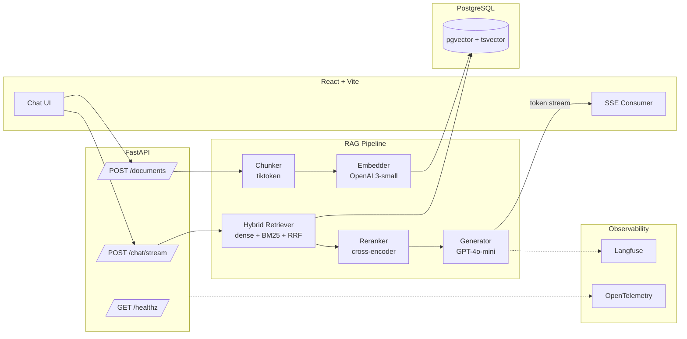

<div align="center">

# Scholaria

**A production-pattern RAG system for course materials and technical documents.**

Ask questions about your lecture notes, textbook chapters, and PDFs. Get answers with cited sources, streamed token-by-token over SSE, evaluated continuously with Ragas.

[Architecture](#architecture) · [Quick Start](#quick-start) · [RAG Pipeline](#rag-pipeline) · [Evaluation](#evaluation) · [Deployment](#deployment)

</div>

---

## Why this exists

Most public RAG demos stop at "PDF in, answer out." Scholaria is built to mirror what a real production RAG service looks like in 2026:

| Concern | What's in here |
| --- | --- |
| **Retrieval quality** | Hybrid search (dense pgvector + Postgres BM25) fused with Reciprocal Rank Fusion, then a cross-encoder reranker |
| **Answer quality** | Cited sources surfaced inline; faithfulness gated in CI via Ragas |
| **Latency** | Server-Sent Events streaming, async ingestion, HNSW indexes |
| **Observability** | Structured JSON logs with request IDs, OpenTelemetry hooks, Langfuse tracing |
| **Operations** | Multi-stage Docker, Alembic migrations, GitHub Actions CI with eval gate, Fly.io deploy |
| **DX** | OpenAPI-typed React client, pre-commit hooks (ruff + mypy + eslint), conventional commits |

## Architecture



**Tech stack** — FastAPI, Pydantic v2, SQLAlchemy 2.0 async, pgvector with HNSW, Alembic, OpenAI + sentence-transformers, LangChain Core for prompt templates, Ragas, Langfuse · React 18, TypeScript, Vite, TanStack Query, Tailwind, shadcn-style components · Docker, GitHub Actions, Fly.io.

## Quick start

```bash
# 1. Clone and configure
cp .env.example .env
# add OPENAI_API_KEY (or set EMBEDDING_PROVIDER=local for sentence-transformers)

# 2. Bring up the stack
docker compose up --build

# 3. Apply migrations + seed a couple of demo PDFs
docker compose exec backend alembic upgrade head
docker compose exec backend python -m scripts.seed_demo_docs

# 4. Open the app
# Frontend  → http://localhost:5173
# API docs  → http://localhost:8000/docs
# Langfuse  → http://localhost:3001 (optional, profile: obs)
```

## RAG pipeline

Scholaria implements the **hybrid + rerank** pattern that the 2026 production literature converges on. Vector search alone misses keyword-anchored questions ("what's the formula for X?"); BM25 alone misses semantic paraphrases. Fusing the two and reranking the union beats either alone by ~30%+ on multi-hop queries.

```
query
  │
  ├──► dense retrieval  (pgvector, HNSW, top-k=20)  ─┐
  │                                                   │
  ├──► sparse retrieval (Postgres tsvector, top-k=20) ┼──► RRF fusion ──► rerank (top-n=5) ──► generate
  │                                                   │
  └──► query expansion (optional, hyDE)              ─┘
```

Implementation is in [`backend/app/rag/`](backend/app/rag/). Each stage is a single-purpose module that can be swapped:

- [`chunker.py`](backend/app/rag/chunker.py) — token-aware recursive splitter with overlap, tuned for technical prose
- [`embeddings.py`](backend/app/rag/embeddings.py) — provider abstraction (OpenAI / sentence-transformers)
- [`retriever.py`](backend/app/rag/retriever.py) — hybrid dense + sparse with RRF
- [`reranker.py`](backend/app/rag/reranker.py) — cross-encoder (`ms-marco-MiniLM-L-6-v2`) with optional Cohere
- [`generator.py`](backend/app/rag/generator.py) — streaming completion with citation parsing
- [`pipeline.py`](backend/app/rag/pipeline.py) — composes the stages and emits SSE events

## Evaluation

Quality without measurement is wishful thinking. Scholaria ships a [Ragas](https://docs.ragas.io/) eval harness wired into CI:

| Metric | Target | What it catches |
| --- | --- | --- |
| **Faithfulness** | ≥ 0.90 | Hallucinated claims not grounded in retrieved context |
| **Context Precision** | ≥ 0.80 | Reranker putting relevant chunks at the top |
| **Answer Relevancy** | ≥ 0.85 | Answers that drift off-topic |
| **Context Recall** | ≥ 0.75 | Retriever missing relevant chunks |

The golden dataset lives in [`backend/eval/golden_dataset.json`](backend/eval/golden_dataset.json). CI runs `python -m eval.run_eval` on every PR; merges are blocked if metrics regress below thresholds. See [`docs/EVAL.md`](docs/EVAL.md) for methodology.

## Project layout

```
Scholaria/
├── backend/
│   ├── app/
│   │   ├── api/routes/      # health, documents, chat
│   │   ├── core/            # config, logging, deps
│   │   ├── db/              # SQLAlchemy 2.0 async models
│   │   ├── rag/             # chunker, embed, retrieve, rerank, generate
│   │   ├── schemas/         # Pydantic v2 DTOs
│   │   └── services/        # ingestion + chat orchestration
│   ├── alembic/             # migrations
│   ├── eval/                # Ragas harness + golden dataset
│   └── tests/               # pytest + pytest-asyncio
├── frontend/
│   └── src/
│       ├── components/      # ChatWindow, MessageBubble, CitationCard, …
│       ├── hooks/           # useChat (SSE), useDocuments (TanStack Query)
│       └── lib/             # typed API client, SSE parser
├── docs/                    # ARCHITECTURE.md, EVAL.md
├── scripts/                 # seed_demo_docs.py
├── .github/workflows/       # CI: lint + type + test + eval gate
├── docker-compose.yml
└── fly.toml
```

## Deployment

Production targets **Fly.io** with Postgres + pgvector on Fly Postgres. The `Dockerfile`s use multi-stage builds (final backend image ~180 MB, frontend ~25 MB nginx). See [`docs/ARCHITECTURE.md`](docs/ARCHITECTURE.md) for the deploy diagram.

```bash
fly launch --copy-config
fly secrets set OPENAI_API_KEY=...
fly deploy
```

## License

MIT.
